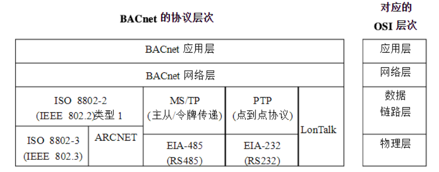

# BACnet

> BACnet（Building Automation and Control networks），是智能建筑的通信协议,其针对智能建筑及控制系统的应用所设计的通信，可用在暖通系统（HVAC，包括暖气、通风、空气调节），也可用咋照明控制、门禁系统、火警检测系统及其相关的设备。

BACnet通信协议定义了几种不同的数据链路层/物理层，包括：

1. ARCNET
2. 以太网
3. BACnet/IP
4. RS-232上的点对点通信
5. RS-485上的主站-从站/令牌传递（Master-Slave/Token-Passing，简称MS/TP）通信
6. LonTalk

| **序号** |    **对象名称**    |       **应用实例**       |
| :------: | :----------------: | :----------------------: |
|    01    |    Accumulator     |          累加器          |
|    02    |    Analog Input    |       模拟输入对象       |
|    03    |   Analog Output    |       模拟输出对象       |
|    04    |    Analog Value    |        模拟值对象        |
|    05    |     Averaging      |          平均器          |
|    06    |    Binary Input    |      二进制输入对象      |
|    07    |   Binary Output    |      二进制输出对象      |
|    08    |    Binary Value    |       二进制值对象       |
|    09    |      Calendar      |        日期表对象        |
|    10    |      Command       |         命令对象         |
|    11    |       Device       |         设备对象         |
|    12    |  Event Enrollment  |       事件登录对象       |
|    13    |     Event Log      |       事件日志对象       |
|    14    |        File        |         文件对象         |
|    15    |    Global Group    |        全局组对象        |
|    16    |       Group        |          组对象          |
|    17    | Life Safety Point  | 生命安全监测点的信息检测 |
|    18    |  Life Safety Zone  |  生面安全区域的信息检测  |
|    19    |        Loop        |        控制环对象        |
|    20    | Multi-State Input  |       多态输入对象       |
|    21    | Multi-State Output |       多态输出对象       |
|    22    | Multi-State Value  |        多态值对象        |
|    23    | Notification Class |        通告类对象        |
|    24    |      Program       |         程序对象         |
|    25    |  Pulse Converter   |        脉冲转换器        |
|    26    |      Schedule      |       时间安排对象       |
|    27    |     Trend Log      |       趋势记录对象       |
|    28    | Trend Log Multiple |      多趋势记录对象      |