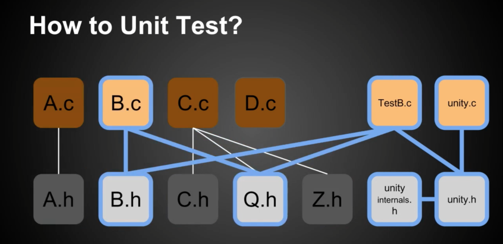

# Build of Unity Test



Refer to [official](https://www.throwtheswitch.org/build/build-unity) website:

Through above picture, in this case, we are testing the module B. Along with B, we pull in TestB, unity, and whatever header files are required by these C files. As we can see, module A, C and D are ignored. This test is compiled, linked, executed, and the results are collected.

And above are basic thoughts about build of Unit Test.

**different build tools:**

* Make
* CMake
* Rake

## 1. Make

> Here we discuss about how to use Make to manage our builds. 

Make is the most widely used build system out here. There are a large portion of the Unity community using Make to manage their builds.

### 1.1 Directories 

For a project, we should have a directory structure looks like this:

* build ---> where all temporary stuff goes
* src ---> where we have all our source code for release ( and to be tested )
* test ---> where we have all our unit tests
* unity ---> where we have copied the latest copy of the Unity project

### 1.2 Makefile

> Makefile decides to how we build our project.

#### 1.2.1 different host

For different hosts, we should change different commands to implement specific functions like rm, del and etc.

| Windows | Linux |
| ------- | ----- |
| del     | rm    |

#### 1.2.2 making paths

Collect all our paths to make our proceed of build more conveniently. 

```makefile
PATHU = unity/src/
PATHS = src/
PATHT = test/
PATHB = build/
PATHD = build/depends/
PATHO = build/objs/
PATHR = build/results/

BUILD_PATHS = $(PATHB) $(PATHD) $(PATHO) $(PATHR)
```

#### 1.2.3 path of source code

As we should tell our compiler where to locate source, it`s necessary to create source path. Like following.

```cmake
SRCT = $(wildcard $(PATHT)*.c)
```

### 1.3 Toolchains

GCC is a popular toolchains.

```makefile
COMPILE=gcc -c
LINK=gcc
DEPEND=gcc -MM -MG -MF
CFLAGS=-I. -I$(PATHU) -I$(PATHS) -DTEST
```

#### 1.3.1 summarizing results

By the time all those things to be built and linked and tested, the only thing left for this rule to actually do is summarize what happened.

It does this by peeking inside our results files with grep and dump the ignored and failed test results for us.

```makefile
test: $(BUILD_PATHS) $(RESULTS)
    @echo "-----------------------\nIGNORES:\n-----------------------"
    @echo `grep -s IGNORE $(PATHR)*.txt`
    @echo "-----------------------\nFAILURES:\n-----------------------"
    @echo `grep -s FAIL $(PATHR)*.txt`
    @echo "\nDONE"
```

#### 1.3.2 creating results

Collect the result of running the test executables and pipe the output to files.

```makefile
RESULTS = $(patsubst $(PATHT)Test%.c,$(PATHR)Test%.txt,$(SRCT))

$(PATHR)%.txt: $(PATHB)%.$(TARGET_EXTENSION)
    -./$< > $@ 2>&1
```

