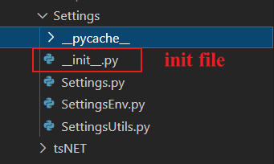
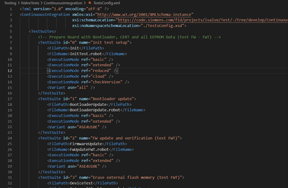
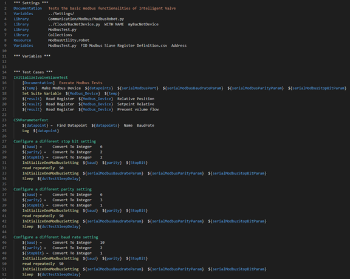

# CI Test

## 1. overview

> CI Test = CI + Test

### 1.1 CI(Continuous Integration)

GitLab is our code repository, which also provides GitLab CI/CD. So how we set up a CI/CD on GitLab ?

#### 1.1.1 CI on GitLab

* .gitlab-ci.yml
* GitLab runner

### 1.2 Test

For test, test framework is RobotFramework which is based on python. So it supports python development. 

#### 1.2.1 setup for RobotFramework

* python environment
* RobotFramework ( a module of python, we just execute following command, eg: pip install RobotFramework)

#### 1.2.3 test architecture

CI Test (iValve for example)

* main.py (entry point)
* TestsConfig.xml (configuration for Test Suites)
* Test Suites (like DeviceTest, ConsoleTest and etc. **include files and directories**)      
* Test Cases (execution functions)
* Keywords (also is functions which only executed when it`s used)
* *.py (python files, as robot is based on python, we can use python to implement some complex functions.)
* Settings (some definitions and settings)

#### 1.2.4 test suites

> A test suite can be created by files or directories.

**1. test case files**

Robot Framework test cases are created using test case sections in test case files. Such a file automatically creates a test suite from all the test cases it contains. 

**2. test suite directories**

To use test suite directories, we have to create a special test suite initialization file like \_init\_.py.

## 2. how to add a new CI test suite

### 2.1 xml file

1. Find the TestsConfig.xml file from Testing\iValveTests\ContinuousIntegration\TestsConfig.xml

2. Add TestSuite id and name in the file

3. Add FilePath by creating a fold in Testing\iValveTests\ContinuousIntegration for the CI test suite

4. Create a .robot file in the fold and add the robot file’s name to the FileName

5. Add ExecutionMode labels, such as basic, extended, cloud and reduced. The labels decide whether the test suite will be executed in the modes.

6. Add another parameter Variant, which is the model of iValve

### 2.2 robot file

Robot file is typically organized through Settings, Variables and Test Cases.

#### 2.3.1 Settings

1) Importing test libraries, resource files and variable files.

2) Defining metadata for test suites and test cases.

#### 2.3.2 Variables       

Defining variables that can be used elsewhere in the test data. 

#### 2.3.3 Test Cases

Test cases are created from keywords that can come from two sources. [Library keywords](https://github.com/robotframework/QuickStartGuide/blob/master/QuickStart.rst#library-keywords) come from imported test libraries, and so called [user keywords](https://github.com/robotframework/QuickStartGuide/blob/master/QuickStart.rst#user-keywords) can be created using the same tabular syntax that is used for creating test cases.

All lowest level keywords are defined in test libraries which are implemented using standard programming languages, typically Python or Java. Robot Framework comes with a handful of [test libraries](http://robotframework.org/#libraries) that can be divided to *standard libraries*, *external libraries* and *custom libraries*. [Standard libraries](http://robotframework.org/robotframework/#standard-libraries) are distributed with the core framework and included generic libraries such as OperatingSystem, Screenshot and BuiltIn, which is special because its keywords are available automatically. External libraries, such as [Selenium2Library](https://github.com/rtomac/robotframework-selenium2library/#readme) for web testing, must be installed separately. 

If available test libraries are not enough, it is easy to [create custom test libraries](https://github.com/robotframework/QuickStartGuide/blob/master/QuickStart.rst#creating-test-libraries) through creating a .py file and realize the required functions in the python file.

For more information about Robot framework, please refer to [User Guide](http://robotframework.org/robotframework/latest/RobotFrameworkUserGuide.html)
