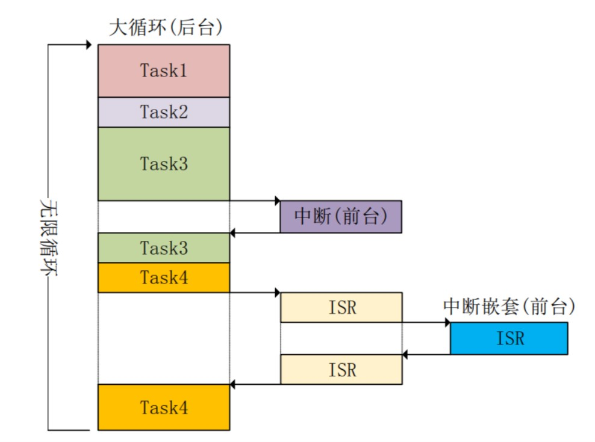
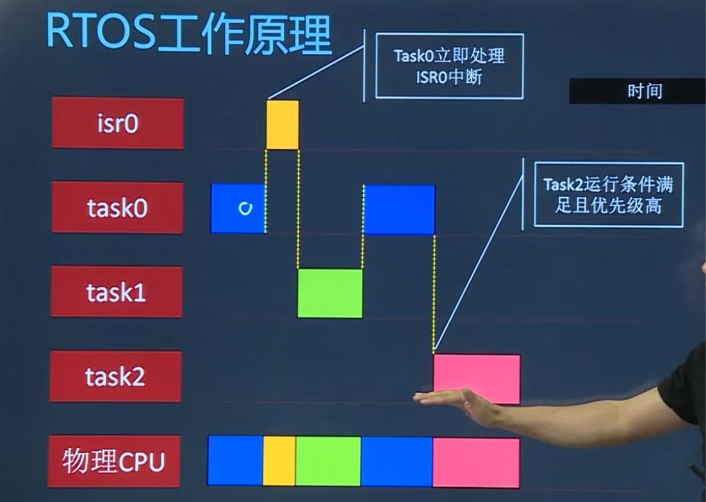
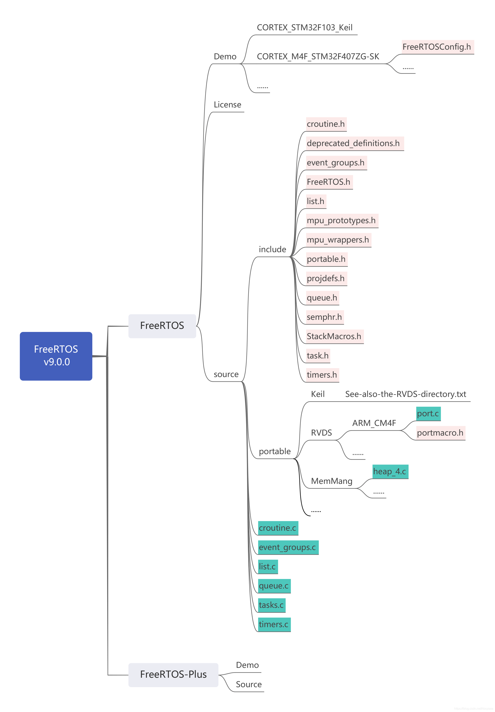

# FreeRTOS
> [FreeRTOS](https://freertos.org/) (Real Time Operating System)，一个迷你的、轻量级的实时操作系统内核。

作为一个轻量级的实时操作系统，功能包括：
1. 任务管理
2. 时间管理
3. 信号量
4. 消息队列
5. 内存管理 
6. 记录功能
7. 软件定时器
8. [协程](https://baike.baidu.com/item/%E5%8D%8F%E7%A8%8B/8652240)（Corotuine）,又称微线程，纤程。  
   * 协程不是进程或线程。其执行过程类似于子例程，亦或说是不带返回值的函数调用。
   * 一个程序可以包含多个线程、协程。类比线程，线程之间是相对独立的，有自己的上下文，切换受系统控制；协程也相对独立，有自己的上下文，**但是其切换由自己控制，由当前协程切换到其他协程由当前协程来控制**。例如，  
        *  coroutine.create()
        *  coroutine.resume()
        *  ......   
            ```
            coroutine.create
            coroutine.resume
            coroutine.running
            coroutine.status
            coroutine.wrap
            coroutine.yield
一个实时操作系统能尽力保障每个任务能在一个已知的最大运行时间(Maximum Response Time)内完成，包括:
* 对中断和内部异常的处理
* 对安全相关的事件的处理
* 任务调度机制    
     
目前市面比较流行的RTOS包括：
* 黑莓QNX
* FreeRTOS
* μC/OS-II
* RT-Thread
* Tencent也推出了TencentOS tiny、华为也推出鸿蒙LiteOS。

## 1、前后台操作系统和RTOS区别
> 前后台操作系统。早期嵌入式开发还没有引入嵌入式OS的概念，直接在裸机上写程序操作裸机。例如，51单片机基本没有操作系统的概念。<font color=red>注：所有OS的入口都是中断。</font>

因此，通常将程序分为两部分：**前台系统、后台系统**。一个简单的前后台系统通常是**一个死循环和若干的中断服务程序**。  
  
* **中断为什么要快进快出？**   
中断是处理紧急事件的。
* **<font color=red>状态机编程是什么？</font>**
* 
>RTOS 强调实时性，操作系统将实时性分为：硬实时和软实时。  

<font color=red>注：
* 实时并不意味着快
* 
</font>

在实时操作系统中，我们可以**把要实现的功能划分为多个任务**，每个任务负责实现其中的一部分，每个任务都是一个很简单的程序，通常是一个**死循环**。RTOS的核心就是**任务调度**。  

<br>


