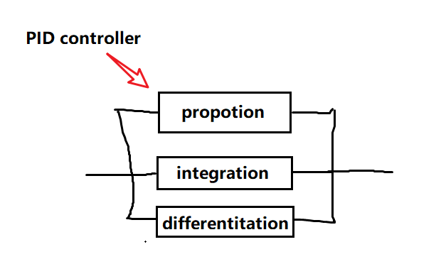

# PID控制算法

这是一个比较常见的控制系统，控制器（controller）部分的实现可以是PID或者PI控制算法。

some common controlling algorithms：

1. PID控制算法
2. 模糊控制
3. 最优控制
4. 滑模
5. 模型预测（MPC）
6. 人工神经网络

## 1. 控制系统

> 检测输出量（被控量）的实际值；将输出量的实际值与给定值（输出量）进行比较得出偏差。
>
> 用偏差值产生控制调节作用去消除偏差，使得输出量维持期望的输出。

* 一般开环控制系统
* 前馈控制系统
* 闭环控制系统
  * 单闭环控制系统
  * 双闭环控制系统
* 复合控制系统（前馈+反馈）

## 2. PID控制算法

> PID（proportion integration differentiation）,指比例、积分、微分。

**Note**：

* PID算法整体来讲是，得到误差（一般为期望值与实际值之间的差值），通过对误差做比例、积分和微分的运算，进而控制actuator。

### 2.1 比例控制算法

即我们只对误差做比例运算，每个时间周期获取当前误差，并将误差乘以合适系数，最后给执行器。但是，这会出现一个“抵消”或“暂态误差”的问题，系统在消灭这个误差的同时也存在一种产生相同的误差（漏水、阻力等等）。这样，系统的误差就会一直这样不变，系统就会产生一种僵局。

### 2.2 积分控制算法

积分变量则是，累计每个时间周期的误差，在比例控制的基础上在加一个积分控制的变量，进而消除“暂态误差”的情况。

### 2.3 微分控制算法

在前两者的控制下（比例积分控制），系统可能会产生较大的震荡。对于某些情况，例如刹车，我们是不希望有这么大的震荡的，因此这里引入微分控制变量（该变量一般都是负的）。
