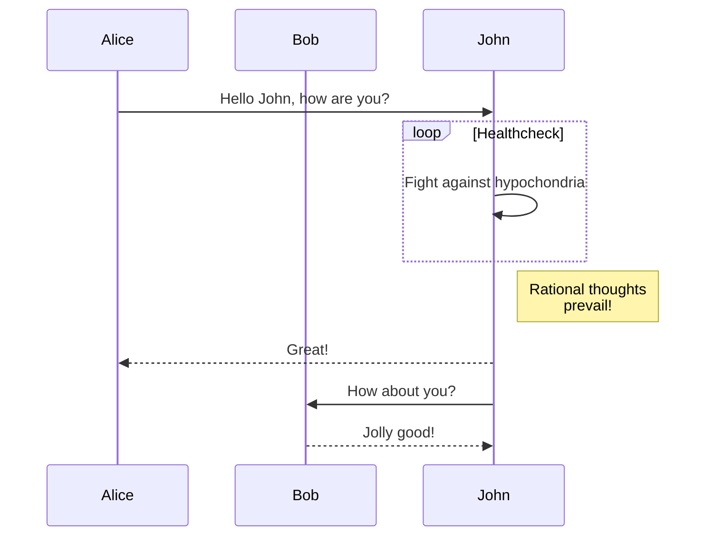
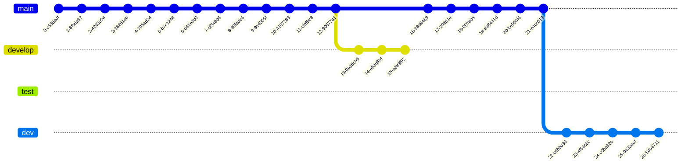

# Modbus RTU time sequence

In modbus protocol, there are 1.5T and 3.5T time sequence required.

## 3.5T (3.5 char time)

> Modbus RTU frame is separated by 3.5 char time. When detecting 3.5t interval, it records one frame.

