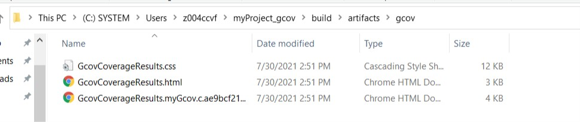

# Ceedling
> Ceedling 是一个**用 Ruby 语言编写**的自动化测试框架，一个 C 项目构建系统，是对 Ruby Rake 的一个延申。Ceedling 主要目标是以测试为驱动的 C 语言开发，集成CMock、Unity、CException三个开源项目。 
## 1.环境搭建
### 1.1 Ruby环境
Windows下，我们使用官方的RubyInstaller安装Ruby环境。[RubyInstaller Archives Link <-----](https://rubyinstaller.org/downloads/archives/
)，选择合适的Ruby版本。
```
PS C:\Users\z004ccvf> Ruby -v
ruby 2.7.2p137 (2020-10-01 revision 5445e04352) [x64-mingw32]
PS C:\Users\z004ccvf> Ruby --version
ruby 2.7.2p137 (2020-10-01 revision 5445e04352) [x64-mingw32]
```
### 1.2 Ceedling安装
首先我们要知道 **gem** （类似于 python 的 pip 、Ubuntu 中的 apt-get 、Node.js 的 NPM 等等）是一个管理 Ruby 库和程序的标准包，通过 gem 可以十分便捷的安装、升级和卸载软件。  
常见的 Ruby gem 指令：  
|Command|Description|
|----|-----|
|gem -v|gem版本|
|gem -h|help|
|gem install -h|install帮助|
|gem update|更新所有包|
|gem install <PACKAGENAME> -v PACKAGEVERSION|安装指定版本的软件包|
|gem environment|查看gem的环境|

有了上面的知识储备，我们现在来安装 Ceedling  
`gem install Ceedling -v 0.30.0`
### 1.3 GCC编译器
对于 Linux 操作系统，可能会自带 GCC 编译环境，但是Windows想要使用 GCC 编译器，一般需要安装 MINGW 或者 Cygwin 。  
这里我们使用 [MINGW](http://mingw-w64.org/doku.php/download) 支持 GCC 编译。
## 2. Demo测试
### 2.1 生成一个 Sample 项目
`ceedling example temp_sensor`
### 2.2 项目测试
`ceedling test:all`
## 3. 创建myProject
### 3.1 ceedling基本使用
```
PS D:\Desktop\workspace\demo> ceedling
Welcome to Ceedling!
Commands:
  ceedling example PROJ_NAME [DEST]  # new specified example project (in DEST...
  ceedling examples                  # list available example projects
  ceedling help [COMMAND]            # Describe available commands or one spe...
  ceedling new PROJECT_NAME          # create a new ceedling project
  ceedling upgrade PROJECT_NAME      # upgrade ceedling for a project (not re...
  ceedling version                   # return the version of the tools installed
```
打开powershell或者cmd，执行ceedling，会得到上述所示提示。
|Command|Description|
|-----|-----|
|ceedling examples|列出ceedling官方的examples|
|ceedling example exampleName|下载example到当前文件路径|
|ceedling new PROJECT_NAME|创建一个空的ceedling测试项目|
|ceedling version|ceedling安装版本|
### 3.2 ceedling new myProject
```
PS D:\Desktop\workspace> ceedling new myProject
Welcome to Ceedling!
      create  myProject/project.yml

Project 'myProject' created!
 - Execute 'ceedling help' from myProject to view available test & build tasks
```
### 3.2 进入workspace
```
PS D:\Desktop\workspace> cd .\myProject\
PS D:\Desktop\workspace\myProject> ls


    Directory: D:\Desktop\workspace\myProject


Mode                LastWriteTime         Length Name
----                -------------         ------ ----
d-----        7/30/2021  10:51 AM                src
d-----        7/30/2021  10:51 AM                test
-a----        7/30/2021  10:51 AM           2516 project.yml
```
此时，我们为src和test文件分别书写一个main.c和test_main.c文件。
```
//main.c
void main(){
	printf("hello world!\n");
}
```
```
//test_main.c
void setUp(void)
{
}

void tearDown(void)
{
}

void testMain(){
	printf("succeed!\n");
}
```

### 3.3 "ceedling test:all" or "ceedling"

```
PS D:\Desktop\workspace\myProject> ceedling


Test 'test_main.c'
------------------
Generating runner for test_main.c...
Compiling test_main_runner.c...
Compiling test_main.c...
test/test_main.c: In function 'testMain':
test/test_main.c:10:2: warning: implicit declaration of function 'printf' [-Wimplicit-function-declaration]
  printf("succeed!\n");
  ^~~~~~
test/test_main.c:10:2: warning: incompatible implicit declaration of built-in function 'printf'
test/test_main.c:10:2: note: include '<stdio.h>' or provide a declaration of 'printf'
test/test_main.c:1:1:
+#include <stdio.h>
 void setUp(void)
test/test_main.c:10:2:
  printf("succeed!\n");
  ^~~~~~
Compiling unity.c...
Compiling cmock.c...
Linking test_main.out...
Running test_main.out...

-----------
TEST OUTPUT
-----------
[test_main.c]
  - "succeed!"

--------------------
OVERALL TEST SUMMARY
--------------------
TESTED:  1
PASSED:  1
FAILED:  0
IGNORED: 0
```
这样，你就实现了一个简单的ceedling测试项目了。
## 4. Ceedling使用gcovr测试代码覆盖
### 4.1 安装gcovr
这要求你的电脑现在拥有python环境  
`pip install gcovr`  
安装成功之后查看对应的version
```
C:\Users\z004ccvf>gcovr --version
gcovr 5.0
Copyright 2013-2018 the gcovr authors
Copyright 2013 Sandia Corporation
Under the terms of Contract DE-AC04-94AL85000 with Sandia Corporation,
the U.S. Government retains certain rights in this software.
```
### 4.2 ceedling new myProject_gcov
```
C:\Users\z004ccvf>ceedling new myProject_gcov
Welcome to Ceedling!
      create  myProject_gcov/project.yml

Project 'myProject_gcov' created!
 - Execute 'ceedling help' from myProject_gcov to view available test & build tasks
```
此时我们创建了一个空的ceedling项目，现在打开project.yml文件，使项目支持gcov代码覆盖检查。 
```
:plugins:
  :load_paths:
    - "#{Ceedling.load_path}"
  :enabled:
    - stdout_pretty_tests_report
    - module_generator
    - gcov  #添加gcov功能
```
### 4.3 创建测试代码
在src和test文件，创建所需的测试函数和代码。  
```
//test_myGcov.c
#include "myGcov.h"
void setUp(void)
{
}

void tearDown(void)
{
}
void testMyGCOV(){
	myGcov();
}
```
```
//myGcov.c
#include "myGcov.h"
void myGcov(){
	printf("this is myGcov!\n");
}
```
```
#include <stdio.h>
void myGcov();
```
然后执行`ceedling gcov:all utils:gcov`  
```
C:\Users\z004ccvf\myProject_gcov>ceedling gcov:all utils:gcov


Test 'test_myGcov.c'
--------------------
Generating runner for test_myGcov.c...
Compiling test_myGcov_runner.c...
Compiling test_myGcov.c...
Linking test_myGcov.out...
Running test_myGcov.out...
Creating a gcov HTML report in 'build/artifacts/gcov'... Done in 0.926 seconds.

-----------------
GCOV: TEST OUTPUT
-----------------
[test_myGcov.c]
  - "this is myGcov!"

--------------------------
GCOV: OVERALL TEST SUMMARY
--------------------------
TESTED:  1
PASSED:  1
FAILED:  0
IGNORED: 0


---------------------------
GCOV: CODE COVERAGE SUMMARY
---------------------------
myGcov.c Lines executed:100.00% of 3
myGcov.c No branches
myGcov.c Calls executed:100.00% of 1
```
`cd C:\Users\z004ccvf\myProject_gcov\build\artifacts\gcov`
可以看见覆盖率测试报告，如下  

