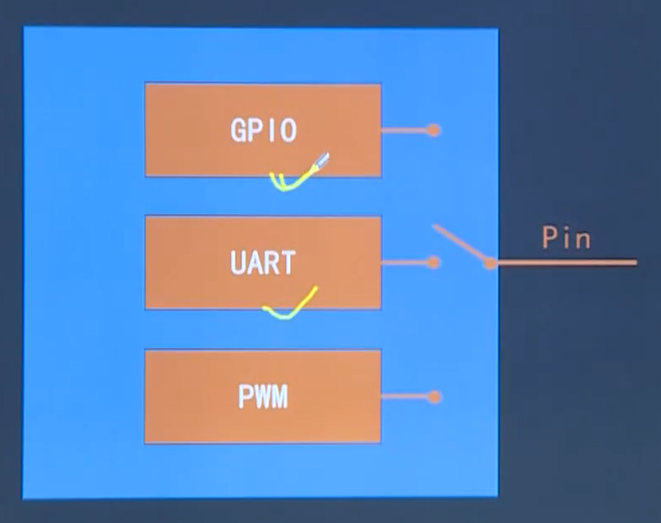

# 总线

> 总线（BUS）是计算机各功能之间传送信息的公共通信干线，由导线组成的传输线束。

按照计算机所传输的信息种类，计算机总线可以划分为：

1. 数据总线
2. 地址总线
3. 控制总线

Definition：

**总线宽度**：总线可同时传输数据数，以比特为单位，总线宽度越大，传输性能愈加

**总线带宽**（单位时间可以传输的总数据数）：总线带宽 = 频率 x 宽度（Bytes/sec）

## 1. PC机总线

## 2. 嵌入式系统中常见的总线

### 2.1 内部总线

|内部总线|工作方式|速率|
|:--:|:---:|:--:|
|IIC总线|半双工异步通信|较慢|
|SPI总线|全双工同步通信|较快|
|SCI总线|||

#### 2.1.1 IIC总线

#### 2.1.2 SPI总线

#### 2.1.3 SCI总线

### 2.2 系统总线

#### 2.2.1 ISA总线

#### 2.2.2 EISA总线

#### 2.2.3 VESA总线

### 2.3 外部总线

#### 2.3.1 UART

> UART（Universal Asynchronous Receiver Transmitter），通用异步收发器，通用串行、异步通信总线。该总线有两根数据线，可以实现全双工的发送和接收。

波特率：用于描述UART通信时的通信速度，bps（bit per sec）。

**注：**

串口空闲时，为高电平。

引脚功能图：

#### 2.3.2 USB总线

#### 

