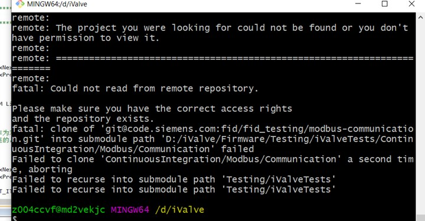

# 多重包含
多重包含会让编译器做重复的计算，但是不会有实际的编译错误。     
# Cortex
[Cortex](https://baike.baidu.com/item/cortex/4476976)(简单讲，就是[ARM](https://www.arm.com/)公司一个列的处理器。类比[酷睿](https://baike.baidu.com/item/%E9%85%B7%E7%9D%BF)、[奔腾](https://baike.baidu.com/item/%E5%A5%94%E8%85%BE%E5%A4%84%E7%90%86%E5%99%A8/673315?fromtitle=%E5%A5%94%E8%85%BE&fromid=15416142)、[赛扬](https://baike.baidu.com/item/%E8%B5%9B%E6%89%AC/861179))属于ARMv7架构，这是到2010年为止ARM公司最新的指令集架构。   
ARMv7系列架构定义了三大系列：
* "A系列"。面向尖端的基于虚拟内存的操作系统和用户应用。例如，麒麟9000-八核芯片组有有1个3130 MHz的Cortex-A77内核，3个2540 MHz的Cortex-A77内核和2050 MHz的4核Cortex-A55组成。
* "R系列"。针对RTOS。
* "M系列"。微控制器。
# git clone --recursive "resporitory url"
  

# while（1）和for（；；）的区别？
两者都是实现死循环的方式，但是大部分情况使用for（；；），这是因为从汇编的角度来看，前者的代码更长，执行的时间要长一些。  

# 常用的配置文件格式

* **ini文件**: 这个在windows下用的比较多,只支持一层参数，太复杂的项目就不适用了。
* **xml文件**：上古时代就开始用了，每个标签可以自定认，但是格式很复杂，容易搞混。
* **json文件**：现在前后端交互的行业标准，搞互联网的没有人不认识，但有个头痛的地方就是不能注释（可以写一个不用的字段把注释内容写进去，但不建议）。
* **yaml文件**：比较新的一种配置文件格式，通俗易懂。但也有个头痛的地方，就是对齐和空格要注意雨露均沾，这个有点像Python的语法（Python开发者要随身带一把游标卡尺）。
# .NET Framework
.NET Framework是用于Windows的新托管代码编程模型。
其实顾名思义FrameWork，就已经说明可他最最核心的含义，就是一套框架，是微软公司提供的一套支持C++，C，C#等等多种语音的开发框架。有点类似于JDK之类的。   
综上所述，.Net FrameWork就是微软提供的一整套支持C系列各种语言的API和各种丰富的资源框架。可以帮助开发者快速便捷轻松的开发出复杂度较高的高级程序和网页
# .gitkeep
在使用Git的时候如果文件夹是空的则不会被git add，因此有时为了git add成功空文件夹，我们可以在文件夹下放一个.gitkeeper文件。

